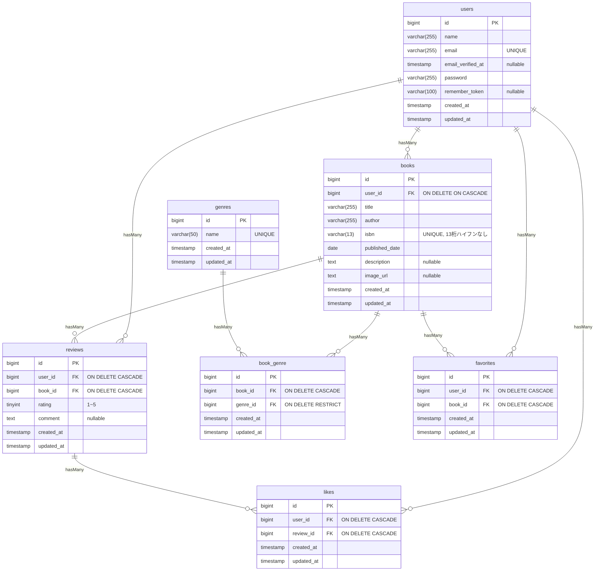

# [CT]

## 概要

## ER図

中間テーブルにはそれぞれ以下の複合ユニーク制約があります。
- reviews: `unique(user_id, book_id)`
- book_genre: `unique(book_id, genre_id)`
- favorites: `unique(user_id, book_id)`
- likes: `unique(user_id, review_id)`

## 環境構築手順

## テストの実行方法

## 
