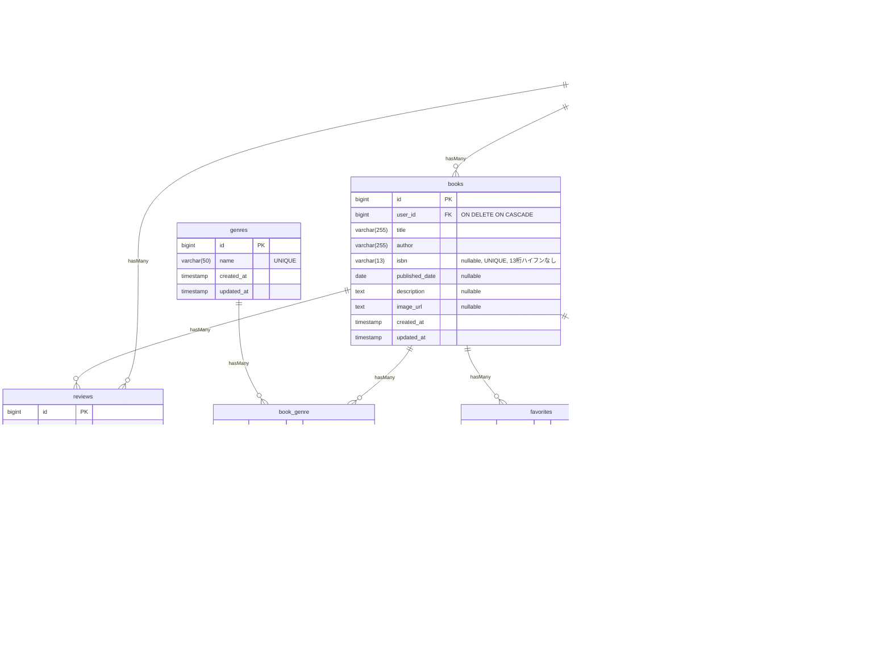

# [CT] 読書管理アプリ

## 概要
本プロジェクトは、書評（書籍のレビュー）を投稿・閲覧できるアプリケーションです。<br>
ユーザーは新しく書籍を登録したり、書籍に対する評価やレビューコメントを投稿することができます。<br>
また、自分の投稿したレビューから、評価傾向や好みの書籍傾向を振り返ったり、読書計画を管理することができます。

書籍の登録・一覧取得や、書籍情報の更新・削除についてのAPIも公開しているため、外部システムと連携したCRUD操作を行うこともできます。

## ER図

```mermaid
erDiagram
    users {
        bigint id PK
        varchar(255) name
        varchar(255) email "UNIQUE"
        timestamp email_verified_at "nullable"
        varchar(255) password
        varchar(100) remember_token "nullable"
        timestamp created_at
        timestamp updated_at
    }
    
    genres {
        bigint id PK
        varchar(50) name "UNIQUE"
        timestamp created_at
        timestamp updated_at
    }
    
    books {
        bigint id PK
        bigint user_id FK "ON DELETE ON CASCADE"
        varchar(255) title
        varchar(255) author
        varchar(13) isbn "nullable, UNIQUE, 13桁ハイフンなし"
        date published_date "nullable"
        text description "nullable"
        text image_url "nullable"
        timestamp created_at
        timestamp updated_at
    }
    
    reviews {
        bigint id PK
        bigint user_id FK "ON DELETE CASCADE"
        bigint book_id FK "ON DELETE CASCADE"
        tinyint rating "1~5"
        text comment
        timestamp created_at
        timestamp updated_at
    }
    
    book_genre {
        bigint id PK
        bigint book_id FK "ON DELETE CASCADE"
        bigint genre_id FK "ON DELETE RESTRICT"
        timestamp created_at
        timestamp updated_at
    }
    
    favorites {
        bigint id PK
        bigint user_id FK "ON DELETE CASCADE"
        bigint book_id FK "ON DELETE CASCADE"
        timestamp created_at
        timestamp updated_at
    }
    
    review_likes {
        bigint id PK
        bigint user_id FK "ON DELETE CASCADE"
        bigint review_id FK "ON DELETE CASCADE"
        timestamp created_at
        timestamp updated_at
    }
    
    reading_plans {
        bigint id PK
        bigint user_id FK "ON DELETE CASCADE"
        bigint book_id FK "ON DELETE CASCADE"
        date target_date
        varchar(255) status
        completed_at timestamp "nullable"
        created_at timestamp
        updated_at timestamp
    }
    
    users ||--o{ books : "hasMany"
    users ||--o{ reviews : "hasMany"
    users ||--o{ favorites : "hasMany"
    users ||--o{ review_likes : "hasMany"
    users ||--o{ reading_plans: "hasMany"
    
    books ||--o{ reviews : "hasMany"
    books ||--o{ favorites : "hasMany"
    books ||--o{ book_genre: "hasMany"
    books ||--o{ reading_plans: "hasMany"
    
    genres ||--o{ book_genre : "hasMany"
    
    reviews ||--o{ review_likes : "hasMany"
```
中間テーブルにはそれぞれ以下の複合ユニーク制約があります。
- book_genre: `unique(book_id, genre_id)`
- favorites: `unique(user_id, book_id)`
- review_likes: `unique(user_id, review_id)`
- reading_plans: `unique(user_id, book_id)`

## 環境構築手順
本プロジェクトはLaravel Sailを利用して構築されています。
1. リポジトリのクローン
```
git clone git@github.com:rnapyzz/bookshelf-app.git
cd bookshelf-app
```

2. 環境変数の設定
```
cp .env.example .env
```
※ テストのカバレッジを計測したい場合は、`.env`の`XDEBUG_MODE`を`coverage`に変更してください。
※ ISBNによる入力補助機能を使用する場合は、Google Cloud Consoleでから発行したAPIキーを`.env`の`GOOGLE_BOOKS_API_KEY`に設定してください。

3. Laravel Sailのインストール
```
docker run --rm \
    -u "$(id -u):$(id -g)" \
    -v "$(pwd):/var/www/html" \
    -w /var/www/html \
    -e COMPOSER_CACHE_DIR=/tmp/composer_cache \
    laravelsail/php82-composer:latest \
    composer require laravel/sail --dev
```

4. Sailの設定ファイルをパブリッシュ
```
docker run --rm \
    -u "$(id -u):$(id -g)" \
    -v "$(pwd):/var/www/html" \
    -w /var/www/html \
    -e COMPOSER_CACHE_DIR=/tmp/composer_cache \
    laravelsail/php82-composer:latest \
    php artisan sail:install --with=mysql
```

5. Dockerコンテナの起動
```
./vendor/bin/sail up -d
```

6. フロントエンドの起動
```
./vendor/bin/sail npm install
./vendor/bin/sail npm run dev
```

7. アプリケーションキーの生成
```
./vendor/bin/sail artisan key:generate
```

8. マイグレーションの実行（初期データの投入）
```
./vendor/bin/sail artisan migrate --seed
```
既存のデータベースをリセットして再マイグレーションしたい場合は、<br>
`./vendor/bin/sail artisan migrate:fresh --seed`で実行してください。

## テストの実行方法
- 全テストの実行

`./vendor/bin/sail test`

- カバレッジの計測

`./vendor/bin/sail test --coverage`

※ テストのカバレッジを計測したい場合は、`.env`の`XDEBUG_MODE`を`coverage`に変更してください。

## 外部API（GoogleBooksAPI）の使用について
本アプリケーションでは、Google Books APIを使用したISBNによる書籍検索・入力補助が使用可能です。  
Google Cloud Console から GoogleBooksAPI を有効化し、APIキーを発行した上で<br>
`.env`の`GOOGLE_BOOKS_API_KEY`に設定してください。
```
// .envの以下の your_api_key の部分を発行したAPIに置き換えてください 
GOOGLE_BOOKS_API_KEY=your_api_key
```

## 使用技術
- Backend: PHP 8.2, Laravel 10.x
- Frontend: Vite, TailwindCSS ^3.4.0
- Web Server: Nginx
- Database: MySQL 8.0
- Tools:
  - Docker (Laravel Sail)
  - phpMyAdmin

## APIエンドポイント
| メソッド | URL                  | 概要      | 認証 |
|:-----|:---------------------|:--------|:---|
| POST | /api/v1/login        | ログインする  | 不要 |
| GET  | /api/v1/books        | 書籍一覧を取得する | 不要 |
| GET  | /api/v1/books/{book} | 書籍詳細を取得する | 不要 |
| POST | /api/v1/books        | 書籍を新規登録する | 必要 |
| PUT  | /api/v1/books/{book} | 書籍情報を更新する | 必要 |
| DELETE | /api/v1/books/{book} | 書籍を削除する | 必要 |

※ 認証が必要なAPIを使用する場合は、ログインのAPI（`/api/v1/login`）を実行し、<br>
返却されたトークンを `Authorizationヘッダ`に Bearerトークン として設定してリクエストしてください。

## バッチ処理の実行
本アプリケーションでは、読書計画に関して、
- リマインダーの通知の発行
- 期限の切れた計画の状態変更（`期限切れ`ステータスへの変更）

のバッチ処理が実行できます。

以下のコマンドを実行することで即時にバッチを起動できます。
```
sail artisan books:send-reminders
```

## 開発環境URL
`http://localhost`

## 作成者
Kosei.T
